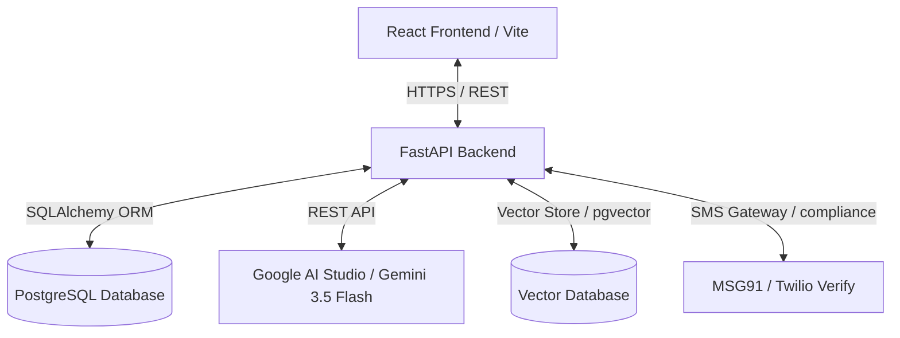
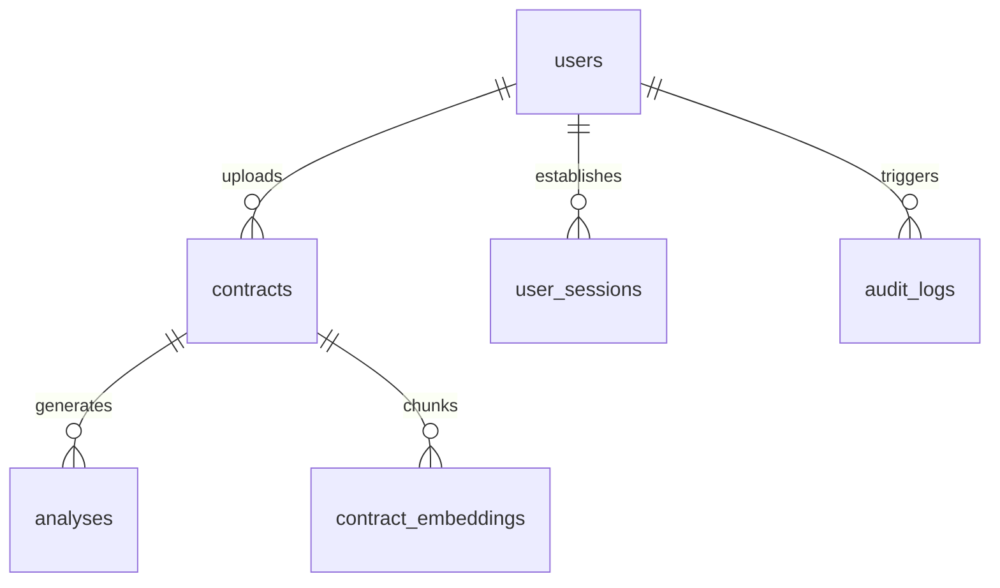

# AI Legal Document Intelligence Platform — Architecture & Design

This document details the system design, database schemas, and security architecture of the platform.

---

## 🏗️ System Overview

The platform uses a decoupled client-server architecture built for low-latency analysis, secure data storage, and scalable multi-agent reasoning.



---

## 🔒 Security & Sessions (Day 8 Architecture Specification)

The application maintains strict access control to protect sensitive legal documents. 

### 1. Token Model
To support multi-device tracking, absolute session expiry, and token revoking, the authentication system uses a dual-token design:
* **Access Token**: Short-lived JSON Web Token (JWT) with a **15-minute lifetime** containing the user identity (`sub` claim). Signed with `HS256` using `JWT_SECRET_KEY`.
* **Refresh Token**: Long-lived secure token with a **7-day lifetime**. Stored in a database-backed session table, hashed at rest.

### 2. Database Schema: User Sessions
The `user_sessions` table tracks active devices and tokens:

```sql
CREATE TABLE user_sessions (
    id SERIAL PRIMARY KEY,
    user_id INTEGER NOT NULL REFERENCES users(id) ON DELETE CASCADE,
    refresh_token_hash VARCHAR(255) NOT NULL UNIQUE,
    device_info VARCHAR(512),
    ip_address VARCHAR(45),
    created_at TIMESTAMP WITH TIME ZONE NOT NULL DEFAULT NOW(),
    last_active_at TIMESTAMP WITH TIME ZONE NOT NULL DEFAULT NOW(),
    expires_at TIMESTAMP WITH TIME ZONE NOT NULL,
    is_revoked BOOLEAN NOT NULL DEFAULT FALSE
);
```

### 3. Auto-Logout Policy
To protect accounts on shared or unattended devices, the platform implements two timeout thresholds:
* **Idle Timeout (15 minutes)**: 
  * *Backend*: On every authenticated request, the backend updates `last_active_at`. If `last_active_at` is older than 15 minutes, the request is rejected with a `401 SESSION_EXPIRED` payload.
  * *Frontend*: A client-side hook monitors mouse/keyboard interactions. A warning modal is shown at 13 minutes. If no action is taken by 15 minutes, local storage is cleared and the user is redirected to `/login`.
* **Absolute Session Limit (7 days)**: Regardless of user activity, all sessions expire exactly 7 days after initial creation (`expires_at`), requiring a fresh password login.

### 4. Phone-Based Two-Factor Authentication (2FA)
A second verification layer is implemented for Indian mobile numbers (`+91` prefix):
* Uses MSG91 (DLT compliance registered) or Twilio Verify for reliable Indian carrier delivery routes.
* Verifies phone numbers on registration/login using a 6-digit OTP code hashed at rest.
* Limits verification attempts (max 5) and enforces cooldowns (30s) to prevent spam.

---

## 📊 Database Schema (Day 3 & Day 5 Base)



### Core Tables
1. **`users`**: Core user accounts.
2. **`contracts`**: Metadata for uploaded PDF contracts (paths, processing status, and ownership).
3. **`analyses`**: Structured JSON/JSONB results containing classified clauses, flagged compliance issues, and risk profiles.
4. **`audit_logs`**: Append-only log tracking all security events and operations (login, registration, upload, analysis).

---

## 🧠 AI Agent Pipeline (Day 20 LangGraph Architecture)

Document analysis is managed by 5 specialized agents coordinated via LangGraph:

1. **Parser Agent (Agent 1)**: Extracts raw PDF text and classifies the document type (e.g., NDA, Lease).
2. **Clause Agent (Agent 2)**: Employs RAG (Retrieval-Augmented Generation) against contract chunks to find target terms.
3. **Risk Agent (Agent 3)**: Flags unfavorable/unlimited liability clauses and suggests negotiations.
4. **Compliance Agent (Agent 4)**: Compares clauses against standard legal templates loaded in the `legal_knowledge` vector base.
5. **Q&A Agent (Agent 5)**: Resolves user questions with strict references to source contract paragraphs.
