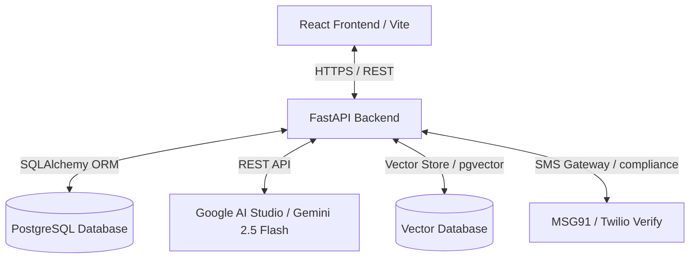
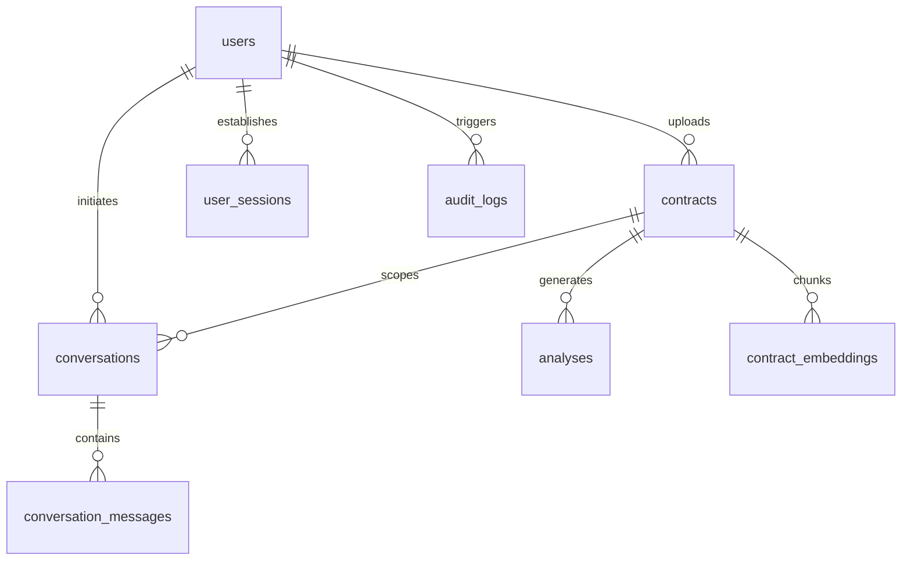
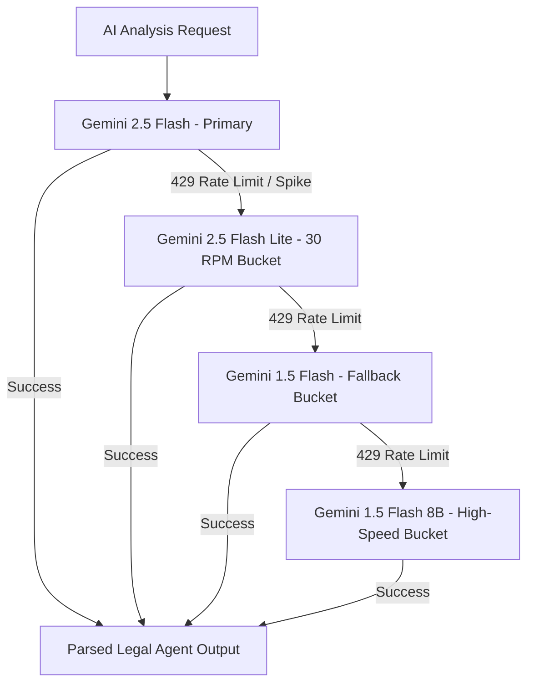

# AI Legal Document Intelligence Platform — Architecture & Design

This document details the system design, database schemas, and security architecture of the platform.

---

## 🏗️ System Overview

The platform uses a decoupled client-server architecture built for low-latency analysis, secure data storage, and scalable multi-agent reasoning.


```mermaid
graph TD
    Client[React Frontend / Vite] <-->|HTTPS / REST| API[FastAPI Backend]
    API <-->|SQLAlchemy ORM| DB[(PostgreSQL Database)]
    API <-->|REST API| Gemini[Google AI Studio / Gemini 2.5 Flash]
    API <-->|Vector Store / pgvector| Vector[(Vector Database)]
    API <-->|SMS Gateway / compliance| SMS[MSG91 / Twilio Verify]
```

---

## 🔒 Security & Sessions (Day 8 Architecture Specification)

The application maintains strict access control to protect sensitive legal documents. 

### 1. Token Model
To support multi-device tracking, absolute session expiry, and token revoking, the authentication system uses a dual-token design:
* **Access Token**: Short-lived JSON Web Token (JWT) with a **40-minute lifetime** containing the user identity (`sub` claim). Signed with `HS256` using `JWT_SECRET_KEY`.
* **Refresh Token**: Long-lived secure token with a **7-day lifetime**. Stored in a database-backed session table, hashed at rest.

### 2. Database Schema: User Sessions
The `user_sessions` table tracks active devices and tokens:

```sql
CREATE TABLE user_sessions (
    id SERIAL PRIMARY KEY,
    user_id INTEGER NOT NULL REFERENCES users(id) ON DELETE CASCADE,
    refresh_token_hash VARCHAR(255) NOT NULL UNIQUE,
    device_info VARCHAR(512),
    ip_address VARCHAR(45),
    created_at TIMESTAMP WITH TIME ZONE NOT NULL DEFAULT NOW(),
    last_active_at TIMESTAMP WITH TIME ZONE NOT NULL DEFAULT NOW(),
    expires_at TIMESTAMP WITH TIME ZONE NOT NULL,
    is_revoked BOOLEAN NOT NULL DEFAULT FALSE
);
```

### 3. Auto-Logout Policy
To protect accounts on shared or unattended devices, the platform implements two timeout thresholds:
* **Idle Timeout (40 minutes)**: 
  * *Backend*: On every authenticated request, the backend updates `last_active_at`. If `last_active_at` is older than 40 minutes, the request is rejected with a `401 SESSION_EXPIRED` payload.
  * *Frontend*: A client-side hook monitors mouse/keyboard interactions. A warning modal is shown at 38 minutes. If no action is taken by 40 minutes, local storage is cleared and the user is redirected to `/login`.
* **Absolute Session Limit (7 days)**: Regardless of user activity, all sessions expire exactly 7 days after initial creation (`expires_at`), requiring a fresh password login.

### 4. Email-Based Two-Factor Authentication (2FA) (Phase 2A)
A second verification layer delivers cryptographic one-time passwords directly to registered user email addresses:
* Generates 6-digit cryptographically secure OTP tokens hashed with SHA-256 at rest in `email_otp_verifications`.
* Enforces strict 5-minute expiry limits, 5-attempt brute-force lockouts, and 30-second cooldown throttles on resend requests.
* Issues short-lived pending JWT verification tokens during the login handshake, blocking unverified access to core routes until 2FA completes.

---

## 📊 Database Schema (Day 3, Day 5, & Day 45 Enterprise Architecture)


```mermaid
erDiagram
    users ||--o{ contracts : uploads
    users ||--o{ user_sessions : establishes
    users ||--o{ audit_logs : triggers
    users ||--o{ conversations : initiates
    contracts ||--o{ analyses : generates
    contracts ||--o{ contract_embeddings : chunks
    contracts ||--o{ conversations : scopes
    conversations ||--o{ conversation_messages : contains
```

### Core Tables
1. **`users`**: Core user accounts with 2FA flags, password hashes, and active states.
2. **`contracts`**: Metadata for uploaded PDF contracts (paths, processing status, and ownership).
3. **`analyses`**: Structured JSON/JSONB results containing classified clauses, flagged compliance issues, and 3-tier risk profiles.
4. **`audit_logs`**: Append-only security and operational audit trail tracking events (`action`), execution status (`status`), network context (`ip_address`, `user_agent`), and metadata (`metadata_json`). Foreign key uses `ON DELETE SET NULL` to preserve immutable compliance records if a user account is deleted.
5. **`conversations`**: Stateful legal dialogue threads tied to a user and contract, maintaining editable titles and chronological sorting (`last_message_at`). Foreign key uses `ON DELETE CASCADE`.
6. **`conversation_messages`**: Dialogue turns with role (`user`/`assistant`), full response text, and structured citation coordinates (`cited_clause_refs` in JSONB) linking legal claims directly to verbatim contract chunks. Foreign key uses `ON DELETE CASCADE`.
7. **`user_sessions`**: Active user sessions for idle timeout enforcement and token revocation.
8. **`email_otp_verifications`**: Ephemeral SHA-256 hashed 2FA verification codes with attempt counts and expiration timestamps.

### Architectural Boundary: Audit Trail vs. Conversation History
A critical design requirement is the deliberate segregation between two types of historical records:
* **Compliance Audit Trail (`audit_logs`)**: An immutable, append-only security log for forensic tracking and audit compliance. Rows are never edited or removed during ordinary operations. Foreign key to `users` is `ON DELETE SET NULL`, ensuring the audit trail remains intact if an account is closed.
* **Interactive Dialogue State (`conversations` & `conversation_messages`)**: Dynamic, user-facing, and editable structured data. Users can browse past threads, resume discussions, rename titles, and delete conversations. When a contract or user is deleted, associated conversation threads are cascade-deleted (`ON DELETE CASCADE`) to respect user privacy and data retention policies.

---

## 🧠 AI Agent Pipeline (Day 20 LangGraph Architecture)

Document analysis is managed by 5 specialized agents coordinated via LangGraph:

1. **Parser Agent (Agent 1)**: Extracts raw PDF text and classifies the document type (e.g., NDA, Lease).
2. **Clause Agent (Agent 2)**: Employs RAG (Retrieval-Augmented Generation) against contract chunks to find target terms.
3. **Risk Agent (Agent 3)**: Flags unfavorable/unlimited liability clauses and suggests negotiations.
4. **Compliance Agent (Agent 4)**: Compares clauses against standard legal templates loaded in the `legal_knowledge` vector base.
5. **Q&A Agent (Agent 5)**: Resolves user questions with strict references to source contract paragraphs.

---

## ⚡ 100% Free-Tier Google Gemini AI Architecture & Resilience (Day 44 Specification)

The platform is designed to operate **100% cost-free** on Google AI Studio free tier services with zero paid API credits or third-party dependencies, leveraging multi-model quota diversification, intelligent retry backoffs, and in-memory deduplication caching.

### 1. Free-Tier Quota Diversification (Separate Per-Model Buckets)
Google AI Studio grants **independent, non-overlapping free quota pools** for distinct Gemini model families under the same free API key:

| Free Tier Model | Primary Use Case | Free Daily Cap | Rate Limit (RPM) | Quota Pool |
| :--- | :--- | :---: | :---: | :--- |
| **`gemini-2.5-flash`** | Primary Multi-Agent Parsing & Synthesis | **1,500 RPD** | 15 RPM | Bucket A |
| **`gemini-2.5-flash-lite`** | High-Speed Clause Extraction & Fallback | **1,500 RPD** | 30 RPM | Bucket B (Independent) |
| **`gemini-1.5-flash`** | Statutory Compliance & Secondary Fallback | **1,500 RPD** | 15 RPM | Bucket C (Independent) |
| **`gemini-1.5-flash-8b`** | Compact Chunk Triage | **1,500 RPD** | 15 RPM | Bucket D (Independent) |
| **`text-embedding-004`** | Semantic Search & Vector Embeddings | **1,500 RPD** | 1,500 RPM | Embeddings Pool |

* **Combined Free Capacity:** By cascading across these distinct model families, the platform achieves up to **6,000 free requests per day** without a single paid credit.
* **Automatic Early Warning:** Telemetry alerts at **80% of daily capacity** (1,200 calls/day on primary model) via the `/admin/ai-usage` dashboard.

### 2. Multi-Model Free-Tier Cascade

```mermaid
graph TD
    Request[AI Analysis Request] --> M1[Gemini 2.5 Flash - Primary]
    M1 -->|429 Rate Limit / Spike| M2[Gemini 2.5 Flash Lite - 30 RPM Bucket]
    M2 -->|429 Rate Limit| M3[Gemini 1.5 Flash - Fallback Bucket]
    M3 -->|429 Rate Limit| M4[Gemini 1.5 Flash 8B - High-Speed Bucket]
    M1 -->|Success| Response[Parsed Legal Agent Output]
    M2 -->|Success| Response
    M3 -->|Success| Response
    M4 -->|Success| Response
```

### 3. Zero-Cost Free-Tier Optimization Techniques
1. **Tenacity Exponential Backoff & Jitter:** Transient 15 RPM rate bursts are automatically retried within 2–4 seconds without failing the workflow.
2. **Analysis Result Memory Caching:** Repeated analysis requests are served in $<5\text{ms}$ from `InMemoryLRUTTLCache` at **0 API cost and 0 quota consumption**.
3. **Chunk Level Deduplication:** Ingested contract clauses with identical text signatures bypass LLM re-extraction.
4. **LangChain Multi-Model Fallbacks:** All LangGraph nodes are equipped with `.with_fallbacks([fallback_lite, fallback_15])` ensuring continuous execution.
