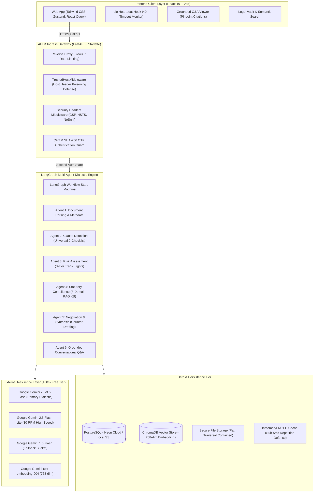
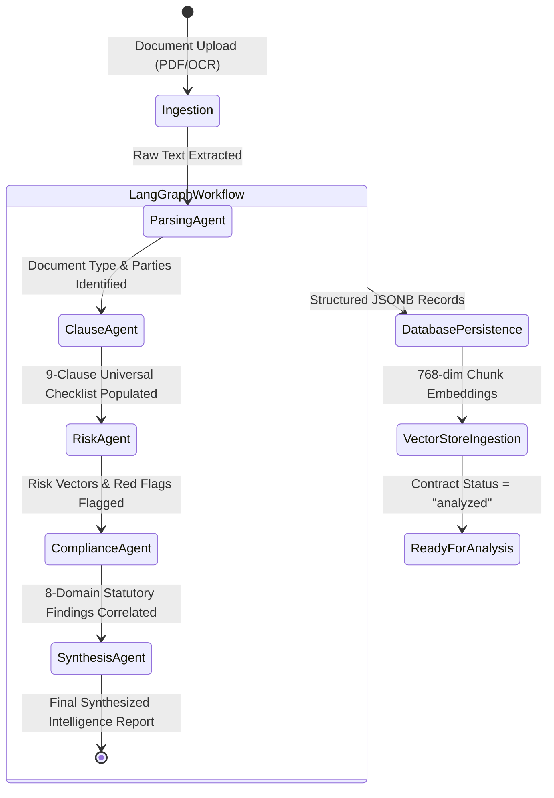
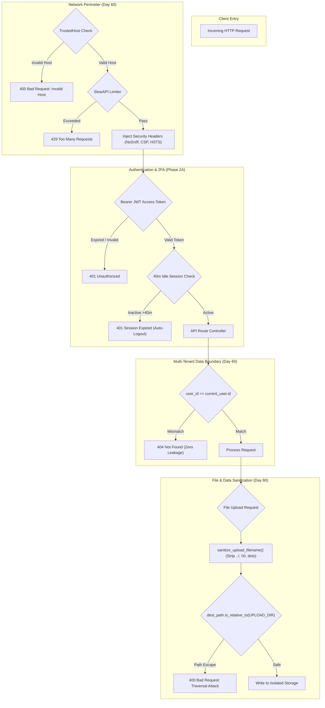
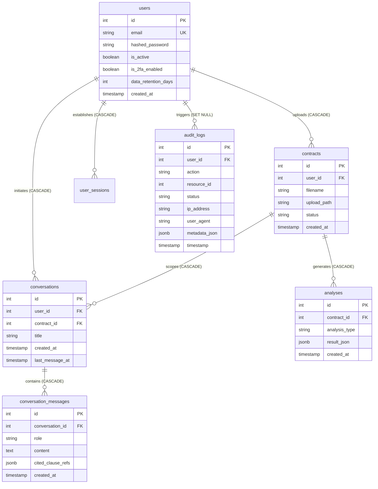
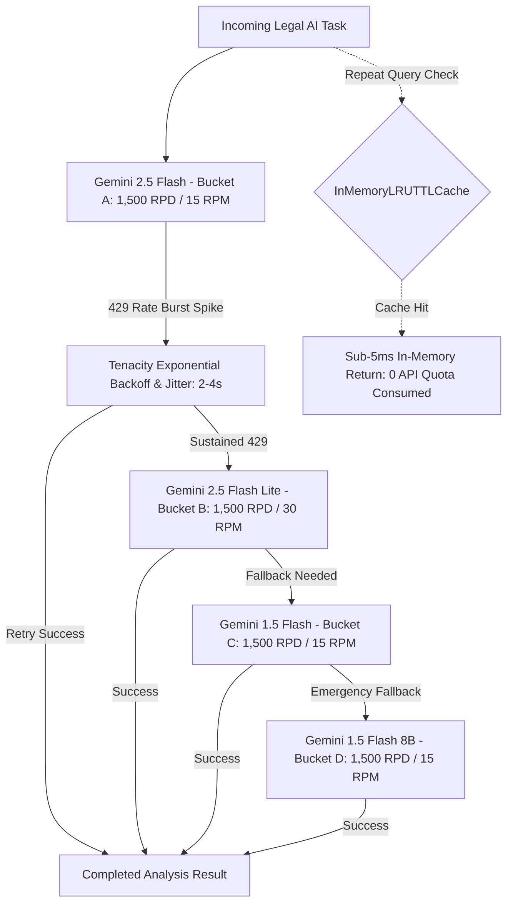
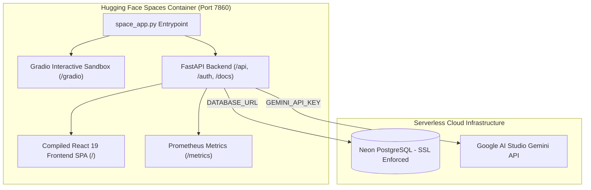

# AI Legal Document Intelligence Platform — Comprehensive Architecture & Design

> **Production-Grade System Architecture & Design Specification**  
> An autonomous multi-agent dialectic platform engineered to extract, audit, risk-score, and negotiate complex commercial legal agreements with 100% data boundary isolation and zero paid cloud API dependencies.

---

## 🏗️ 1. System Overview & Core Topology

The platform is designed around a decoupled, event-driven client-server architecture engineered for low latency, hardened multi-tenant isolation, enterprise security compliance, and resilient multi-agent dialectical reasoning.

```mermaid
graph TD
    subgraph ClientLayer["Frontend Client Layer (React 19 + Vite)"]
        UI["Web App (Tailwind CSS, Zustand, React Query)"]
        Idle["Idle Heartbeat Hook (40m Timeout Monitor)"]
        ChatUI["Grounded Q&A Viewer (Pinpoint Citations)"]
        VaultUI["Legal Vault & Semantic Search"]
    end

    subgraph GatewayLayer["API & Ingress Gateway (FastAPI + Starlette)"]
        Proxy["Reverse Proxy (SlowAPI Rate Limiting)"]
        HostCheck["TrustedHostMiddleware (Host Header Poisoning Defense)"]
        SecHeaders["Security Headers Middleware (CSP, HSTS, NoSniff)"]
        AuthFilter["JWT & SHA-256 OTP Authentication Guard"]
    end

    subgraph AgentLayer["LangGraph Multi-Agent Dialectic Engine"]
        WF["LangGraph Workflow State Machine"]
        A1["Agent 1: Document Parsing & Metadata"]
        A2["Agent 2: Clause Detection (Universal 9-Checklist)"]
        A3["Agent 3: Risk Assessment (3-Tier Traffic Lights)"]
        A4["Agent 4: Statutory Compliance (8-Domain RAG KB)"]
        A5["Agent 5: Negotiation & Synthesis (Counter-Drafting)"]
        QA["Agent 6: Grounded Conversational Q&A"]
    end

    subgraph StorageLayer["Data & Persistence Tier"]
        PG[(PostgreSQL - Neon Cloud / Local SSL)]
        Chroma[(ChromaDB Vector Store - 768-dim Embeddings)]
        Uploads["Secure File Storage (Path Traversal Contained)"]
        MemCache["InMemoryLRUTTLCache (Sub-5ms Repetition Defense)"]
    end

    subgraph ExternalServices["External Resilience Layer (100% Free Tier)"]
        GeminiFlash["Google Gemini 2.5/3.5 Flash (Primary Dialectic)"]
        GeminiLite["Google Gemini 2.5 Flash Lite (30 RPM High Speed)"]
        Gemini15["Google Gemini 1.5 Flash (Fallback Bucket)"]
        GeminiEmbed["Google Gemini text-embedding-004 (768-dim)"]
    end

    UI -->|HTTPS / REST| GatewayLayer
    GatewayLayer -->|Scoped Auth State| AgentLayer
    AgentLayer --> StorageLayer
    AgentLayer --> ExternalServices
    StorageLayer --> PG
```

---

## 🧠 2. LangGraph Multi-Agent Dialectic & Orchestration Workflow

Rather than relying on single-prompt summaries that miss cross-sectional trapdoors, the platform deploys a 5-agent dialectic state machine coordinated via **LangGraph**.

```mermaid
stateDiagram-v2
    [*] --> Ingestion: Document Upload (PDF/OCR)
    Ingestion --> ParsingAgent: Raw Text Extracted
    
    state LangGraphWorkflow {
        ParsingAgent --> ClauseAgent: Document Type & Parties Identified
        ClauseAgent --> RiskAgent: 9-Clause Universal Checklist Populated
        RiskAgent --> ComplianceAgent: Risk Vectors & Red Flags Flagged
        ComplianceAgent --> SynthesisAgent: 8-Domain Statutory Findings Correlated
        SynthesisAgent --> [*]: Final Synthesized Intelligence Report
    }

    LangGraphWorkflow --> DatabasePersistence: Structured JSONB Records
    DatabasePersistence --> VectorStoreIngestion: 768-dim Chunk Embeddings
    VectorStoreIngestion --> ReadyForAnalysis: Contract Status = "analyzed"
```

### Agent Roles & Specifications

| Agent | Module | Model Quota Bucket | Core Responsibilities & Deterministic Invariants |
| :--- | :--- | :--- | :--- |
| **Agent 1: Document Parsing** | [`parsing_agent.py`](file:///home/oliveoil/Documents/Notes_and_Documentation/Old%20One%20Drive/AI%20Legal%20Document%20Intelligence%20Platform/backend/app/agents/parsing_agent.py) | Gemini 2.5 Flash (Bucket A) | Extracts clean document text, determines structural classifications (NDA, MSA, Lease, Employment, Consulting), and parses executing entities, effective dates, and supervisory jurisdictions. |
| **Agent 2: Clause Detection** | [`clause_agent.py`](file:///home/oliveoil/Documents/Notes_and_Documentation/Old%20One%20Drive/AI%20Legal%20Document%20Intelligence%20Platform/backend/app/agents/clause_agent.py) | Gemini 2.5 Flash Lite (Bucket B) | **Universal 9-Clause Checklist Invariant**: Evaluates all 9 mandatory contract clauses (`payment_terms`, `termination_clauses`, `liability_clauses`, `confidentiality_clauses`, `intellectual_property_clauses`, `dispute_resolution_clauses`, `governing_law_clauses`, `renewal_clauses`, `indemnification_clauses`) on 100% of contracts with `present: bool`, `text: str`, and `location: str`. |
| **Agent 3: Risk Assessment** | [`risk_agent.py`](file:///home/oliveoil/Documents/Notes_and_Documentation/Old%20One%20Drive/AI%20Legal%20Document%20Intelligence%20Platform/backend/app/agents/risk_agent.py) | Gemini 2.5 Flash (Bucket A) | **3-Tier Traffic Light Classification**: Categorizes exposures into `RED_FLAG` / `HIGH` (unlimited liability, unilateral arbitration, void non-competes), `YELLOW_FLAG` / `MEDIUM` (broad indemnities, fee escalations), and `GREEN_FLAG` / `LOW` (standard exclusions, mutual protections). |
| **Agent 4: Statutory Compliance** | [`compliance_agent.py`](file:///home/oliveoil/Documents/Notes_and_Documentation/Old%20One%20Drive/AI%20Legal%20Document%20Intelligence%20Platform/backend/app/agents/compliance_agent.py) | Gemini 1.5 Flash (Bucket C) | **8-Domain Legal Taxonomy RAG**: Benchmarks clauses against codified statutory rules (DPDPA 2023 / GDPR, Arbitration Act §12(5), Contract Act §27, Copyright Act §19(5), Shops & Establishments, Transfer of Property). |
| **Agent 5: Negotiation & Synthesis** | [`workflow.py`](file:///home/oliveoil/Documents/Notes_and_Documentation/Old%20One%20Drive/AI%20Legal%20Document%20Intelligence%20Platform/backend/app/agents/workflow.py) | Gemini 2.5 Flash (Bucket A) | Correlates findings into executive summaries and counter-drafting redlines (Balanced, Protective, Aggressive) ready for legal counsel. |
| **Agent 6: Grounded Q&A** | [`qa_agent.py`](file:///home/oliveoil/Documents/Notes_and_Documentation/Old%20One%20Drive/AI%20Legal%20Document%20Intelligence%20Platform/backend/app/agents/qa_agent.py) | Gemini 2.5 Flash / Lite | **Strict Anti-Hallucination Citations**: Answers plain-language questions strictly using source text chunks, returning exact `cited_clause_refs` JSON with section, title, and page coordinates. |

---

## 🔒 3. Identity, Sessions & Security Hardening Architecture

Security is architected as a core defense-in-depth system, ensuring compliance with banking-grade access control standards.

```mermaid
graph TD
    subgraph Client["Client Entry"]
        Req["Incoming HTTP Request"]
    end

    subgraph PerimeterDefense["Network Perimeter (Day 60)"]
        HostValidation{"TrustedHost Check"}
        HostValidation -->|Invalid Host| E400["400 Bad Request: Invalid Host"]
        HostValidation -->|Valid Host| RateLimit{"SlowAPI Limiter"}
        RateLimit -->|Exceeded| E429["429 Too Many Requests"]
        RateLimit -->|Pass| SecHeaders["Inject Security Headers (NoSniff, CSP, HSTS)"]
    end

    subgraph AuthLayer["Authentication & 2FA (Phase 2A)"]
        SecHeaders --> JWTCheck{"Bearer JWT Access Token"}
        JWTCheck -->|Expired / Invalid| E401["401 Unauthorized"]
        JWTCheck -->|Valid Token| IdleCheck{"40m Idle Session Check"}
        IdleCheck -->|Inactive >40m| E401Expired["401 Session Expired (Auto-Logout)"]
        IdleCheck -->|Active| RouteHandler["API Route Controller"]
    end

    subgraph DataBoundary["Multi-Tenant Data Boundary (Day 60)"]
        RouteHandler --> TenancyCheck{"user_id == current_user.id"}
        TenancyCheck -->|Mismatch| E404["404 Not Found (Zero Leakage)"]
        TenancyCheck -->|Match| Exec["Process Request"]
    end

    subgraph StorageSafety["File & Data Sanitization (Day 60)"]
        Exec --> FileUpload{"File Upload Request"}
        FileUpload --> Sanitize["sanitize_upload_filename() (Strip ../, \\0, dots)"]
        Sanitize --> ContainmentCheck{"dest_path.is_relative_to(UPLOAD_DIR)"}
        ContainmentCheck -->|Path Escape| E400Traversal["400 Bad Request: Traversal Attack"]
        ContainmentCheck -->|Safe| DiskWrite["Write to Isolated Storage"]
    end
```

### Security Specifications

1. **Dual-Token Lifetime & Session Revocation:**
   - **Access Token**: Short-lived JWT (**40-minute lifetime**), signed with `HS256`.
   - **Refresh Token**: Long-lived token (**7-day lifetime**), stored exclusively as a 64-character SHA-256 hash (`refresh_token_hash`) in `user_sessions`. Users can view active sessions and revoke individual devices or all remote sessions.
2. **Email-Based Two-Factor Authentication (Email OTP 2FA):**
   - Cryptographically random 6-digit verification codes.
   - Hashed with SHA-256 at rest in `email_otp_verifications` (`otp_hash`), with 5-minute expiry limits, 30-second resend cooldowns, and a 5-attempt brute-force lockout threshold.
   - Plain codes are strictly suppressed in console logs in `production` and `staging` environments.
3. **Automated Auto-Logout & Idle Heartbeat:**
   - On every authenticated call, the server updates `user_sessions.last_active_at`. If inactive for $>40$ minutes, the session is invalidated with `401 SESSION_EXPIRED`.
   - The React frontend runs a background activity listener (`IdleTimer.tsx`), warning the user at 38 minutes and auto-redirecting to `/login?expired=true` at 40 minutes.
4. **Host Header Poisoning Defense:**
   - Starlette `TrustedHostMiddleware` verifies incoming `Host` headers against configured `ALLOWED_HOSTS` (`localhost`, `127.0.0.1`, `0.0.0.0`, `testserver`, `*.hf.space`, `huggingface.co`), rejecting spoofed headers with `400 Bad Request`.
5. **Path Traversal Containment & Filename Sanitization:**
   - `sanitize_upload_filename()` strips leading paths (`os.path.basename`), replaces path traversal sequences (`../`, `..\\`), eliminates leading dots (preventing hidden files like `.env`), and whitelists safe characters.
   - `dest_path.is_relative_to(upload_dir)` ensures that even encoded exploits cannot escape the target upload directory.
6. **Sensitive Credential Log Scrubbing:**
   - `sanitize_audit_metadata()` recursively redacts passwords, tokens, API keys, and OTP codes before serializing to PostgreSQL `audit_logs.metadata_json`.

---

## 📊 4. Database Schema & Data Architecture (Phase 6)

```mermaid
erDiagram
    users ||--o{ contracts : "uploads (CASCADE)"
    users ||--o{ user_sessions : "establishes (CASCADE)"
    users ||--o{ audit_logs : "triggers (SET NULL)"
    users ||--o{ conversations : "initiates (CASCADE)"
    contracts ||--o{ analyses : "generates (CASCADE)"
    contracts ||--o{ conversations : "scopes (CASCADE)"
    conversations ||--o{ conversation_messages : "contains (CASCADE)"

    users {
        int id PK
        string email UK
        string hashed_password
        boolean is_active
        boolean is_2fa_enabled
        int data_retention_days
        timestamp created_at
    }

    contracts {
        int id PK
        int user_id FK
        string filename
        string upload_path
        string status
        timestamp created_at
    }

    analyses {
        int id PK
        int contract_id FK
        string analysis_type
        jsonb result_json
        timestamp created_at
    }

    conversations {
        int id PK
        int user_id FK
        int contract_id FK
        string title
        timestamp created_at
        timestamp last_message_at
    }

    conversation_messages {
        int id PK
        int conversation_id FK
        string role
        text content
        jsonb cited_clause_refs
        timestamp created_at
    }

    audit_logs {
        int id PK
        int user_id FK
        string action
        int resource_id
        string status
        string ip_address
        string user_agent
        jsonb metadata_json
        timestamp timestamp
    }
```

### Architectural Invariant: Forensic Audit Trail vs. User Dialogue State

A fundamental architectural principle is the strict separation between two types of historical records:
- **Forensic Compliance Audit Trail (`audit_logs`)**:
  - Append-only, immutable record of security and data events.
  - Foreign key to `users` uses `ON DELETE SET NULL`, ensuring compliance audits remain forensically verifiable even if an employee or tenant deletes their profile.
  - Indexed via composite indexes (`(user_id, timestamp)`, `(action, timestamp)`) for rapid telemetry lookups.
- **Interactive Conversational Threads (`conversations` & `conversation_messages`)**:
  - User-facing, editable, and browsable conversation history.
  - Users can rename threads, delete discussions, or purge contracts.
  - Foreign key uses `ON DELETE CASCADE`, ensuring that when a contract or user account is purged, all conversational dialogue and cited clause references are immediately destroyed in compliance with GDPR Article 17 ("Right to Erasure").

---

## ⚡ 5. 100% Free-Tier AI Architecture & Quota Diversification

The platform is designed to operate **100% cost-free** on Google AI Studio's free tier with zero paid credits, utilizing multi-model quota diversification, intelligent retry backoffs, and in-memory deduplication caching.

```mermaid
graph TD
    Req[Incoming Legal AI Task] --> M1[Gemini 2.5 Flash - Bucket A: 1,500 RPD / 15 RPM]
    M1 -->|429 Rate Burst Spike| Tenacity[Tenacity Exponential Backoff & Jitter: 2-4s]
    Tenacity -->|Retry Success| Success[Completed Analysis Result]
    Tenacity -->|Sustained 429| M2[Gemini 2.5 Flash Lite - Bucket B: 1,500 RPD / 30 RPM]
    M2 -->|Success| Success
    M2 -->|Fallback Needed| M3[Gemini 1.5 Flash - Bucket C: 1,500 RPD / 15 RPM]
    M3 -->|Success| Success
    M3 -->|Emergency Fallback| M4[Gemini 1.5 Flash 8B - Bucket D: 1,500 RPD / 15 RPM]
    M4 -->|Success| Success
    
    Req -.->|Repeat Query Check| CacheCheck{InMemoryLRUTTLCache}
    CacheCheck -.->|Cache Hit| Sub5ms[Sub-5ms In-Memory Return: 0 API Quota Consumed]
```

### Free-Tier Capacity Model

| Quota Pool | Model | Daily Cap | Rate Limit (RPM) | Assigned Pipeline Stage |
| :--- | :--- | :---: | :---: | :--- |
| **Bucket A** | `gemini-2.5-flash` | **1,500 RPD** | 15 RPM | Document Parsing, Risk Assessment, Synthesis |
| **Bucket B** | `gemini-2.5-flash-lite` | **1,500 RPD** | 30 RPM | 9-Clause Extraction, Fast Conversational Q&A |
| **Bucket C** | `gemini-1.5-flash` | **1,500 RPD** | 15 RPM | 8-Domain Statutory Compliance RAG |
| **Bucket D** | `gemini-1.5-flash-8b` | **1,500 RPD** | 15 RPM | Compact Chunk Triage & Emergency Redundancy |
| **Embeddings** | `text-embedding-004` | **1,500 RPD** | 1,500 RPM | Semantic Search & Vector Embeddings |

* **Combined Throughput:** Up to **6,000 free requests per day** across independent model buckets under a single free API key.
* **In-Memory Caching:** `InMemoryLRUTTLCache` returns repeated analysis requests in $<5\text{ms}$ with zero quota consumption.

---

## 🚀 6. Deployment & Infrastructure Topology

The application operates as a unified containerized platform deployable to **Hugging Face Spaces (Gradio SDK)** or standard **Docker Compose**:

```mermaid
graph TD
    subgraph HFSpace["Hugging Face Spaces Container (Port 7860)"]
        Supervisor["space_app.py Entrypoint"]
        GradioUI["Gradio Interactive Sandbox (/gradio)"]
        FastAPIApp["FastAPI Backend (/api, /auth, /docs)"]
        ReactStatic["Compiled React 19 Frontend SPA (/)"]
        PrometheusExp["Prometheus Metrics (/metrics)"]
    end

    subgraph ManagedCloud["Serverless Cloud Infrastructure"]
        NeonPostgres[(Neon PostgreSQL - SSL Enforced)]
        GoogleAIStudio[Google AI Studio Gemini API]
    end

    Supervisor --> FastAPIApp
    Supervisor --> GradioUI
    FastAPIApp --> ReactStatic
    FastAPIApp --> PrometheusExp
    FastAPIApp -->|DATABASE_URL| NeonPostgres
    FastAPIApp -->|GEMINI_API_KEY| GoogleAIStudio
```

- **Unified ASGI Host:** Runs both the compiled React 19 SPA, the FastAPI REST API, and the Gradio legal sandbox simultaneously on Hugging Face Spaces standard port `7860`.
- **Database Migrations:** Database migrations (`alembic upgrade head`) execute automatically on container startup.
- **Monitoring & Metrics:** Integrated OpenTelemetry instrumentation exposes Prometheus metrics at `/metrics` tracking analysis latency, HTTP status codes, and active agent execution counts.
