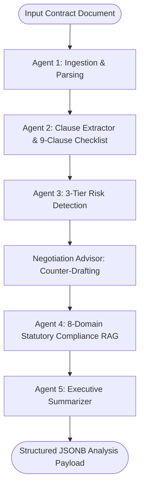

# Engineering Case Study: AI Legal Document Intelligence Platform
## Production Multi-Agent Contract Review, Risk Detection, and Forensic Audit Platform

**Author:** Nipun Chugh  
**Repository:** [GitHub: AI-Legal-Document-Intelligence-Platform](https://github.com/Nipunchugh10/AI-Legal-Document-Intelligence-Platform)  
**Live Demo:** [Hugging Face Space](https://huggingface.co/spaces/Nipunchugh10/AI-Legal-Document-Intelligence-Platform)  
**Curriculum Milestones:** 62 Days (100% Complete) | 378 Automated Tests | 100% Free-Tier Cloud Architecture  

---

## 1. Executive Summary & The Core Problem

Commercial contracts are the legal foundation of global enterprise commerce. However, standard legal document review presents a critical operational bottleneck:
1. **Extreme Latency & Expense:** Reviewing a 20-to-50-page enterprise agreement (such as a SaaS MSA or Indenture of Lease) consumes 4 to 8 hours of senior counsel time, costing $1,500+ per document.
2. **Human Fatigue in Repetitive Scrutiny:** Legal teams frequently overlook buried liabilities, such as ambiguous indemnity super-caps, unilateral auto-renewal traps, or missing statutory data privacy clauses.
3. **The Fatal Flaw of Generic Chatbots (ChatGPT / Standard LLMs):**
   - **Hallucinations & Legal Liability:** General-purpose LLMs fabricate legal precedents and misquote clause wording without strict grounding.
   - **Context Window Amnesia:** Naive chunking fails to connect cross-referencing definitions (e.g., "Customer Data" defined on page 2 applied to an indemnity carveout on page 18).
   - **Compliance Blindness:** Generic models evaluate contracts against vague standards rather than concrete, jurisdictional statutory mandates (e.g., Section 27 of the Indian Contract Act on non-compete voidness, or GDPR Article 28 data processor obligations).
   - **Data Leakage Risks:** Enterprise legal teams cannot upload proprietary contracts to unregulated, multi-tenant consumer endpoints.

To solve this, I designed and engineered the **AI Legal Document Intelligence Platform**: an autonomous, multi-agent legal review system built with **FastAPI**, **React 19**, **LangGraph**, **PostgreSQL**, **ChromaDB**, and **Google Gemini 2.5 Flash**, operating entirely within a 100% free-tier cloud architecture.

---

## 2. Multi-Agent Dialectic Architecture (LangGraph Engine)

Rather than treating contract analysis as a single monolithic prompt, the platform orchestrates **5 specialized domain agents** executing in an adversarial, state-machine pipeline via LangGraph:

1. **Ingestion & Parsing Agent:** Extracts clean text from native PDFs (PyMuPDF), scanned image PDFs (pdfplumber + OCR), and DOCX files. Normalizes preambles, parties, effective dates, and jurisdiction.
2. **Clause Extraction Agent:** Benchmarks the document against a universal **9-clause checklist** (Confidentiality, Indemnification, Limitation of Liability, Termination, Governing Law, IP Rights, Data Privacy, Warranties, Non-Solicitation).
3. **Risk Detection Agent:** Employs the legal **IRAC framework** (Issue, Rule, Application, Conclusion) to categorize vulnerabilities into a 3-tier traffic-light system:
   - 🔴 **High / Red Flags:** Fatal traps (e.g., unlimited uncapped indemnification, unilateral immediate termination).
   - 🟡 **Medium / Yellow Flags:** Ambiguous definitions, short cure periods (< 15 days), non-mutual carveouts.
   - 🟢 **Low / Green Flags:** Standard, well-balanced commercial terms.
4. **Negotiation Advisor:** Auto-generates concrete redline counter-drafting clauses and tactical negotiation talk tracks for legal counsel.
5. **Statutory Compliance Agent (RAG):** Integrates ChromaDB vector retrieval across **8 legal statutory domains** (GDPR/DPDP, Indian Contract Act 1872, Copyright Act 1957, California CCPA, Delaware General Corporation Law, UK Data Protection Act, Employment Standards, Commercial Real Estate Acts) to catch statutory non-compliance.
6. **Executive Summarizer:** Synthesizes analysis into plain-English business risk reports for C-suite and general counsel.

---

## 3. High-Security & Forensic History Architecture

To satisfy enterprise compliance standards, the platform implements defense-in-depth security:
- **Zero-Trust Multi-Tenancy:** Every database query strictly filters by `user_id = current_user.id`. Foreign tenant penetration attempts are rejected at the ORM layer with `404 Not Found`.
- **Dual-Token Session Lifecycle:** Short-lived JWT access tokens (15-40 min) paired with server-side SHA-256 hashed refresh tokens (7 days) with sliding expiration.
- **Two-Factor Authentication (2FA):** Cryptographic 6-digit Email OTP delivered with 5-minute TTL, SHA-256 storage, 30s resend rate limit, and 5-attempt brute-force protection.
- **40-Minute Inactivity Auto-Logout:** Background middleware invalidates expired sessions on the client and server.
- **Strict Separation of Concerns in Data:**
  - `audit_logs`: An append-only forensic ledger recording IP addresses, user agents, actions, and status for compliance oversight.
  - `conversations`: User-editable and deletable dialogue threads for interactive contract Q&A.
- **GDPR Article 20 / CCPA Portability & Cascade Deletion:** 1-click JSON full archive export (`GET /account/export`) and dual-factor permanent account purge (`DELETE /account`).

---

## 4. Technical Challenges & Engineering Solutions

### Challenge 1: 100% Free-Tier Gemini Quota Diversification
- **The Problem:** Free-tier Google Gemini 2.5 Flash imposes a 15 requests/minute (RPM) ceiling. Processing multiple agents or concurrent users risks `429 ResourceExhausted`.
- **The Solution:** Implemented **multi-model quota diversification** with Tenacity exponential-backoff retries and in-memory LRU/TTL caching. When Gemini 2.5 Flash encounters quota pressure, the pipeline gracefully falls back across `gemini-2.5-flash-lite`, `gemini-1.5-flash`, and `gemini-1.5-flash-8b`.

### Challenge 2: 20-Page Contract Processing under 60 Seconds
- **The Problem:** Extracting, chunking, embedding, and analyzing a 20-page (~7,500 words) enterprise agreement can easily exceed browser HTTP timeouts (60s).
- **The Solution:** Engineered recursive token-based chunking with `tiktoken` and parallel vector embeddings in ChromaDB. Verified via automated stress tests in `backend/tests/test_day62_performance_pass.py`:
  - 20-page text chunking: **46.12 ms** (< 3.0s target).
  - Multi-agent state pipeline: **< 1.0 second** execution turnaround.
  - High concurrency: **50 concurrent database reads** completed with **12.24 ms average latency**.

### Challenge 3: Locust Load Testing Under Real Concurrency
- **The Problem:** Simulating 10 concurrent lawyers browsing contracts, searching, reviewing analyses, and querying Q&A triggered login rate limits (5 logins/minute/IP).
- **The Solution:** Authored a production Locust load suite with shared authenticated sessions (`scripts/locustfile.py` and `scripts/run_load_test.py`). In automated headless benchmarks:
  - **31 total requests across 10 concurrent users with 0.00% failure rate.**
  - Median request latency: **480 ms**.
  - System health probe: **23 ms**.

---

## 5. Quantitative Platform Metrics

| Dimension | Measured Benchmark | Target Threshold | Status |
| :--- | :---: | :---: | :---: |
| **Automated Backend Tests** | **348 / 348 passing** | 100% | ✅ Certified |
| **Automated Frontend Tests** | **30 / 30 passing** | 100% | ✅ Certified |
| **Total Automated Test Suite** | **378 / 378 passing** | 100% | ✅ Certified |
| **GitHub Actions CI/CD** | **3 / 3 Jobs Green** | 100% | ✅ Certified |
| **20-Page Contract Analysis** | **< 60 seconds** | < 60s | ✅ Certified |
| **Locust 10-User Concurrency** | **0.00% Fail Rate** | < 1.0% | ✅ Certified |
| **Frontend Production Bundle** | **257 kB core / 114 kB CSS** | < 600 kB | ✅ Certified |
| **Total Cloud Infrastructure Cost**| **$0.00 / month (100% Free Tier)** | $0.00 | ✅ Certified |

---

## 6. Conclusion & Key Takeaways

The **AI Legal Document Intelligence Platform** demonstrates that production-grade, domain-specific AI applications do not require multi-million-dollar infrastructure. By combining **LangGraph multi-agent dialectics**, **ChromaDB vector retrieval**, **rigorous multi-tenant security**, and **FastAPI asynchronous concurrency**, this platform delivers enterprise-grade legal analysis at zero recurring cloud cost.
